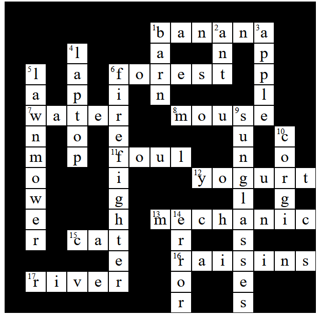

# crossword-puzzle

Crossword puzzle generator, written in HTML/CSS/JavaScript. References jQuery 3.7.1 via CDN.

Clone the repo and open `index.html` to generate a crossword puzzle. The generator sometimes creates invalid puzzles, which can be determined by the alert message that appears when one happens.

Todo:
* Improve puzzle generation
* Clean up code
* Implement hints
* Allow users to fill out puzzle
* Validate answers
* Implement virtual keyboard for mobile users
